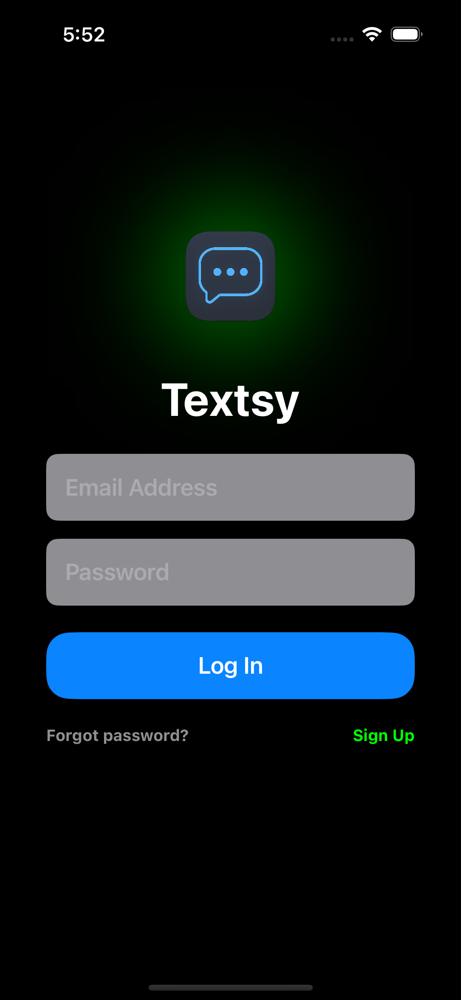
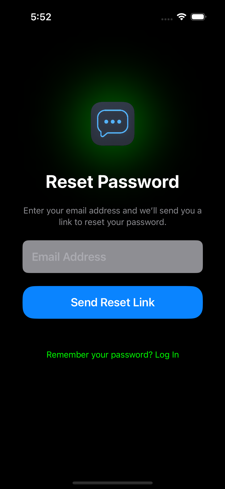
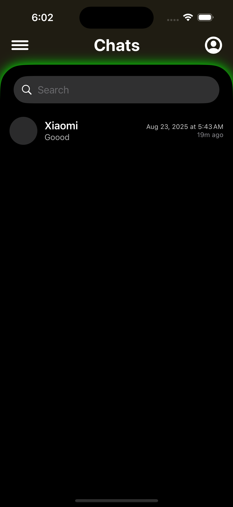
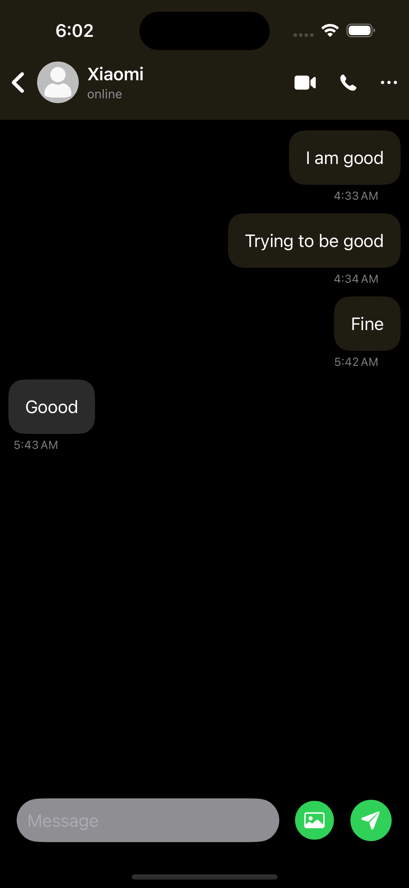
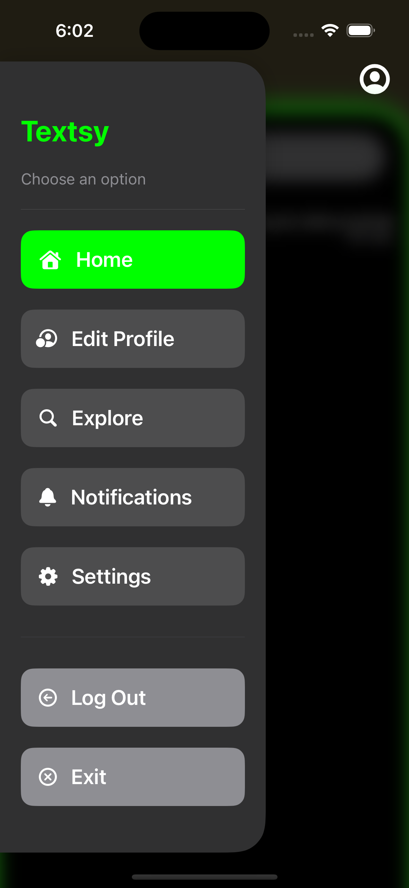
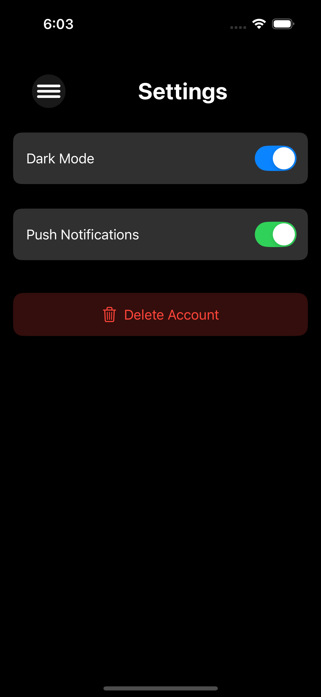

# 📱 Textsy – SwiftUI Chat App  

Textsy is a modern **SwiftUI chat application** built with **MVVM architecture**, **Singleton pattern**, and **Firebase (Auth + Firestore realtime listeners)**.  

It supports **authentication, live messaging, profile management, and notifications**, all in a clean **dark-mode UI**.  

---

## ✨ Features  

- 🔐 **Authentication** – Login, Signup, Reset Password  
- 👤 **Profile Management** – Edit profile, update bio, age, and location  
- 💬 **Realtime Chat** – Send & receive messages instantly  
- 📢 **Notifications** – Chat requests, accept/decline options  
- 🌙 **Dark Mode UI** – Clean and modern interface  
- 🔍 **Search** – Find users or filter chats  
- ⚡ **Dynamic Routing** – Routes based on profile completeness  
- 🗄️ **Offline Caching** – Keeps data locally when offline  
- ⚙️ **Settings** – Dark mode toggle, push notifications, account deletion  

---

## 📸 Screenshots  
 

| Login | Reset Password | Chats |
|-------|----------------|-------|
|  |  |  |

| Chat View | Explore | Sidebar Menu |
|-----------|---------|--------------|
|  |  |  |

| Settings |   |   |
|----------|---|---|
|  |   |   |

---

## 📚 Learning Journey  

I didn’t know coding before, so it took me **33 days to learn SwiftUI from scratch**.  
With the help of **ChatGPT**, I was able to grab code, assemble it, and slowly understand how it works.  

👉 But this project is not just about copy-paste. To build it, you need to **understand the concepts** behind MVVM, Firebase, and SwiftUI.  
For a CS student, this app could be done in about **15 days with 6 hours of focus per day**, though it depends on the person.  

At this stage, I’d say I’m about **60% job-ready**.  
I still struggle with:  
- 🔒 Firestore security rules  
- 💾 Advanced offline persistence  
- 📲 Push notifications  

But I continue to improve step by step.  

---

## 💬 Feedback  

I’d love your feedback on my code!  
If you notice any issue, please create one directly in my repository:  

- 👉 [Post a New Issue](https://github.com/TAUFIK2236/Textsy_ChatApp/issues/new)  
- 📂 [View Repository](https://github.com/TAUFIK2236/Textsy_ChatApp)  

I’ll review and fix problems directly in the repo.  

---

## 🛠️ Tech Stack  

- **SwiftUI**  
- **MVVM Architecture**  
- **Singleton State Management**  
- **Firebase Authentication**  
- **Firestore Realtime Database**  

---

## 🚀 Author  

**Taufik Shahaf**  
- 📧 Contact via GitHub issues  
- 🛠️ Always learning & improving  

---
